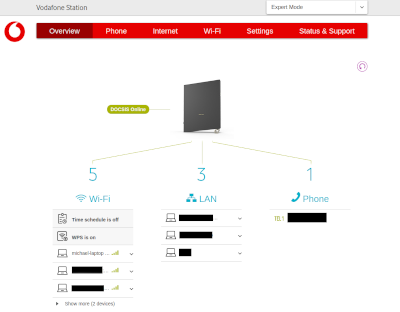
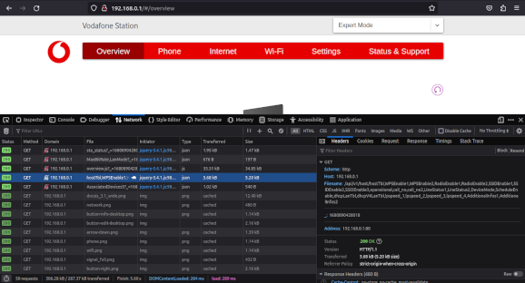

# Reverse Engineering Notes

My notes from reverse engineering the login mechanism and api of the Vodafone
Germany cable internet router (aka Vodafone Station).

## Introduction

I'm fairly minimal on my network set up these days because I'm currently living
in a small apartment. This means I need to connect development hardware
directly to my home router to be able to network with them. To find the IP
addresses assigned by DHCP, I must log in to the web ui and this involves some
tedious steps (find the password, login, click through the ui, etc).

I wanted to be able to scrape that data from the cli so I decided to see if I
can pull that data programatically. I was surprised to discover a "capture the
flag"-like challenge and decided to write it up to share.

## Part 1: Assets not loaded via plain HTML

Logging into the router through the browser shows the list of connected devices
on the overview page. Looking at the HTML however shows no signs of the IP
addresses or device aliases or other related strings that we could see in the
browser.

<p align="center">
<a href="./webui.png"></a>
</p>

Opening the Firefox web developer tools and accessing the network debugger
gives the hint that resolves that mystery. The data is loaded via Javascript
client-side and not part of the HTML.

## Part 2: Discovering the API endpoint for HostTbl

Looking at the network connections made during page load shows the files and
api endpoints accessed. There are javascript files loaded, some asset files
and some api endpoints accessed that return json data.

<p align="center">
<a href="./network-debugger.png"></a>
</p>

The interesting network accesses are to the paths prefixed with /api. These are
the api endpoints of the router. Digging through these show one specific
api endpoint provides back the IP addresses of the connected devices.

```
GET http://192.168.0.1/api/v1/host/hostTbl,WPSEnable1,WPSEnable2,RadioEnable1,
RadioEnable2,SSIDEnable1,SSIDEnable2,SSIDEnable3,operational,call_no,call_no2,
LineStatus1,LineStatus2,DeviceMode,ScheduleEnable,dhcpLanTbl,dhcpV4LanTbl,
lpspeed_1,lpspeed_2,lpspeed_3,lpspeed_4,AdditionalInfos1,AdditionalInfos2?
_=1680890428018

{"error":"ok","message":"all values retrieved","data":{"WPSEnable1":"true","WPS
Enable2":"true","RadioEnable1":"false","RadioEnable2":"true","SSIDEnable1":"fal
se","SSIDEnable2":"true","SSIDEnable3":"false","ScheduleEnable":"false","operat
ional":"OPERATIONAL","call_no":"+49xxxxxxxxxx@xxxxxxxxxxxxxxxxxxxxxxxxx.de","Li
neStatus1":"Registered (Primary)","AdditionalInfos1":"IEP#9;OEP#9","call_no2":"
","LineStatus2":"Not Present","AdditionalInfos2":"","DeviceMode":"Ipv6","lpspee
d_1":"100","lpspeed_2":"100","lpspeed_3":"1000","lpspeed_4":"0","hostTbl":[{"__
id":"1","alias":"xxxxxxxx","physaddress":"xx:xx:xx:xx:xx:xx","ipaddress":"192.1
68.0.73","dhcpclient":"Device.DHCPv4.Server.Pool.1.Client.1","layer1interface":
"","hostname":"xxxxxxxx","active":"false","activeTime":"58471","addresssource":
"DHCP","Comments":"","rssi":"-200","type":"","ipv41":"192.168.0.73","ipv61":"EM
PTY","ipv62":"fe80::xxxx:xxxx:xxxx:xxxx","ipv63":"2a02:xxxx:xxxx:xxxx:xxxx:xxxx
:xxxx:xxxx"},{"__id":"2","alias":"michael-laptop","physaddress":"xx:xx:xx:xx:xx
:xx","ipaddress":"192.168.0.4","dhcpclient":"Device.DHCPv4.Server.Pool.1.Client
.2","layer1interface":"Device.WiFi.SSID.2","hostname":"michael-laptop","active"
:"true","activeTime":"21964","addresssource":"DHCP","Comments":"","rssi":"-55",
"type":"","ipv41":"192.168.0.4","ipv61":"EMPTY","ipv62":"fe80::4791:94e0:3aa0:x
xxx","ipv63":"2a02:8109:8540:333c:xxxx:xxxx:xxxx:xxx"},{"__id":"3","alias":"xx:
xx:xx:xx:xx:xx","physaddress":"xx:xx:xx:xx:xx:xx","ipaddress":"192.168.0.241","
dhcpclient":"Device.DHCPv4.Server.Pool.1.Client.3","layer1interface":"Device.Et
hernet.Interface.3","hostname":"xx:xx:xx:xx:xx:xx","active":"true","activeTime"
:"23047","addresssource":"DHCP","Comments":"","rssi":"-200","type":"","ipv41":"
192.168.0.241","ipv61":"EMPTY","ipv62":"fe80::xxxx:xxxx:xxxx:xxxx","ipv63":"2a0
2:xxxx:xxxx:xxxx:xxxx:xxxx:xxxx:xxxx"},{"__id":"4","alias":"xx:xx:xx:xx:xx:xx",
"physaddress":"xx:xx:xx:xx:xx:xx","ipaddress":"192.168.0.23","dhcpclient":"Devi
ce.DHCPv4.Server.Pool.1.Client.4","layer1interface":"Device.WiFi.SSID.2","hostn
ame":"xx:xx:xx:xx:xx:xx","active":"true","activeTime":"23045","addresssource":"
DHCP","Comments":"","rssi":"-44","type":"","ipv41":"192.168.0.23","ipv61":"EMPT
Y","ipv62":"fe80::xxxx:xxxx:xxxx:xxxx","ipv63":"2a02:xxxx:xxxx:xxxx:xxxx:xxxx:x
xxx:xxxx"},{"__id":"5","alias":"xx:xx:xx:xx:xx:xx","physaddress":"xx:xx:xx:xx:x
x:xx","ipaddress":"192.168.0.113","dhcpclient":"Device.DHCPv4.Server.Pool.1.Cli
ent.5","layer1interface":"Device.WiFi.SSID.2","hostname":"xx:xx:xx:xx:xx:xx","a
ctive":"true","activeTime":"61222","addresssource":"DHCP","Comments":"","rssi":
"-61","type":"","ipv41":"192.168.0.113"},{"__id":"6","alias":"xx:xx:xx:xx:xx:xx
","physaddress":"xx:xx:xx:xx:xx:xx","ipaddress":"192.168.0.200","dhcpclient":"D
evice.DHCPv4.Server.Pool.1.Client.6","layer1interface":"Device.WiFi.SSID.2","ho
stname":"xx:xx:xx:xx:xx:xx","active":"true","activeTime":"61222","addresssource
":"DHCP","Comments":"","rssi":"-43","type":"","ipv41":"192.168.0.200","ipv61":"
EMPTY","ipv62":"fe80::xxxx:xxxx:xxxx:xxxx","ipv63":"2a02:xxxx:xxxx:xxxx:xxxx:xx
xx:xxxx:xxxx"},{"__id":"7","alias":"001788a28eeb","physaddress":"xx:xx:xx:xx:xx
:xx","ipaddress":"192.168.0.133","dhcpclient":"Device.DHCPv4.Server.Pool.1.Clie
nt.7","layer1interface":"Device.Ethernet.Interface.1","hostname":"xxxxxxxxxxxx"
,"active":"true","activeTime":"61223","addresssource":"DHCP","Comments":"","rss
i":"-200","type":"","ipv41":"192.168.0.133","ipv61":"EMPTY","ipv62":"fe80::xxxx
:xxxx:xxxx:xxxx","ipv63":"EMPTY"},{"__id":"8","alias":"plex","physaddress":"xx:
xx:xx:xx:xx:xx","ipaddress":"192.168.0.232","dhcpclient":"Device.DHCPv4.Server.
Pool.1.Client.8","layer1interface":"Device.Ethernet.Interface.2","hostname":"xx
xx","active":"true","activeTime":"61223","addresssource":"DHCP","Comments":"","
rssi":"-200","type":"","ipv41":"192.168.0.232","ipv61":"EMPTY","ipv62":"fe80::x
xxx:xxxx:xxxx:xxxx","ipv63":"2a02:xxxx:xxxx:xxxx:xxxx:xxxx:xxxx:xxxx"},{"__id":
"9","alias":"amazon-72088b8cc","physaddress":"xx:xx:xx:xx:xx:xx","ipaddress":"1
92.168.0.110","dhcpclient":"Device.DHCPv4.Server.Pool.1.Client.9","layer1interf
ace":"Device.WiFi.SSID.2","hostname":"amazon-72088b8cc","active":"true","active
Time":"61222","addresssource":"DHCP","Comments":"","rssi":"-61","type":"","ipv4
1":"192.168.0.110","ipv61":"EMPTY","ipv62":"fe80::xxxx:xxxx:xxxx:xxxx","ipv63":
"2a02:xxxx:xxxx:xxxx:xxxx:xxxx:xxxx:xxxx"}],"dhcpLanTbl":[],"dhcpV4LanTbl":[{"_
_id":"1","physaddress":"xx:xx:xx:xx:xx:xx","ipAddressLan":"192.168.0.73"},{"__i
d":"2","physaddress":"xx:xx:xx:xx:xx:xx","ipAddressLan":"192.168.0.4"},{"__id":
"3","physaddress":"xx:xx:xx:xx:xx:xx","ipAddressLan":"192.168.0.241"},{"__id":"
4","physaddress":"xx:xx:xx:xx:xx:xx","ipAddressLan":"192.168.0.23"},{"__id":"5"
,"physaddress":"xx:xx:xx:xx:xx:xx","ipAddressLan":"192.168.0.113"},{"__id":"6",
"physaddress":"xx:xx:xx:xx:xx:xx","ipAddressLan":"192.168.0.200"},{"__id":"7","
physaddress":"xx:xx:xx:xx:xx:xx","ipAddressLan":"192.168.0.133"},{"__id":"8","p
hysaddress":"xx:xx:xx:xx:xx:xx","ipAddressLan":"192.168.0.232"},{"__id":"9","ph
ysaddress":"xx:xx:xx:xx:xx:xx","ipAddressLan":"192.168.0.110"}]},"token":"aa7be
6ba1d71bxxxx46576bd0b5xxxx3f00c0796c5d3f1d38054xxxxa2f79036"}
```

If I replicate that network request with curl, copying in the headers and
cookies, I hit a security wall and get an "unauthorized access" response:

```
{"error":"error","message":"Unauthorized access!"}
```

## Part 3: The Nonce of the Situation

Looking at the request, there is a query param named "\_". At first I ignored
this parameter thinking it was just noise but I realised it might be related to
my failed attempts to access the api endpoints.

Looking at the network debugger shows the first time this query param gets used
is to access the `bsd_acl_rules.js` file. From there, the other requests
increment the value of the parameter by 1 sequentially.

Digging into the javascript shows it's populated by jquery with the unix
timestamp up to millisecond precision (13 digits).

```
var nonce = Date.now();
```

I assume this is some kind of protection mechanism so that stale URLs do not
get reused by the browser or other tools. It seems to check that a request has
a timestamp relatively close to the current local time on the router and if it
doesn't, it blocks it.

Adding this parameter to my curl command lets me successfully access the api
endpoint and pull the list of connected devices on the router.

```
curl -v \
  -H "X-Requested-With: XMLHttpRequest" \
  --referer 'http://192.168.0.1/' \
  -A 'Mozilla/5.0 (X11; Ubuntu; Linux x86_64; rv:109.0) Gecko/20100101 Firefox/110.0' \
  --cookie "PHPSESSID=822c56c105b353e537406a54b1e510eb;cwd=No" \
  "http://192.168.0.1/api/v1/host/hostTbl?_=$(date +%s%3N)"
```

## Part 4: Finding the Cookie

The network debugging shows that the requests to the router also include a
session cookie (PHPSESSID). This is set by the router software at some point of
the network interactions but interestingly not on the initial page access (the
index html).

Looking at the network accesses, the cookie first appears after accessing the
session api endpoint (`/api/v1/session/dlang`). So this must be accessed in
order to get a cookie to then be able to log in to the router.

## Part 5: Understanding the Login

The login itself is also interesting. Setting the network debugger to the
`persistent logs` mode enables logging the network accesses across multiple
pages which is the case for the login.

With persistent logging turned on, I could trace an actual login performed in
the browser and see what data is transferred and the responses.

The login seems simple at first with the browser making a request to a session
api endpoint: `/api/v1/session/login`. But it does not send the login data and
instead sends a request with the following form data.

```
username=admin
password=seeksalthash
```

The endpoint responds with a json payload containing two values: `salt` and
`saltwebui`.

```
{"error":"ok","salt":"kxbf8pyhmkkp","saltwebui":"9MIw1aXgDzCp"}
```

The browser then sends a second request to the same endpoint but with a hash of
the admin password.

```
username=admin
password=32dd055052fc682e1e23dc97241504d8
```

It seems the password is being salted by the salt values retrieved in the first
api request. Searching through the Javascript files loaded for saltwebui reveals
that the password is being hashed with pbkdf2 in two rounds. A first round with
the password and the "salt" (with 1000 iterations and trimmed to 128 bits)
followed by a second round with the result of the first round and the
"saltwebui" (again with 1000 iterations and trimmed to 128 bits).

The javascript snippets in question:

```
function doPbkdf2NotCoded(passwd, saltLocal) {
  var derivedKey = sjcl.misc.pbkdf2(passwd, saltLocal, 1000, 128);
  var hexdevkey = sjcl.codec.hex.fromBits(derivedKey);
  return hexdevkey;
}

var hashed1 = doPbkdf2NotCoded($("#password").val(), distantsaltstored);
$.ajax({
  url: 'api/session/login',
  type: 'POST',
  data: {
    username: username,
    password: doPbkdf2NotCoded(hashed1, distantsaltstoredWebui)
  }
})
```

I found a Python implementation for [pbkdf2][0] and using the sniffed values
from the network debugger began trying to replicate the hashes. At first I
didn't have much success but then by looking at the Javascript I found the
algorithm used sha256 while the Python module I was using defaulted to SHA1.

Switching from sha1-hmac to sha256-hmac made it possible to replicate the
password hashing in Python and I could write a Python script to get a cookie
from the router and perform the log in. But trying to use that cookie to then
access the host api endpoint, like I did previously, failed with "unauthorized
access".

## Part 6: There Can Only Be One

At first it seemed to work to log in but on second try the api endpoint to
login responded with an error code. The message was set to `MSG_LOGIN_150`.

In the browser, this scenario can be replicated by trying to log in twice at
the same time from different sessions. In the browser a pop up shows that
allows you to "force log out" the current user and then logging in can proceed.

The network debugger shows in this case that a second login attempt is made but
this time the network request to get the salt values includes another parameter
named "logout" which is set to the string "true".

Replicating this in the Python script allowed the login to always succeed but I
would still hit the "unauthorized access" error when trying to scrape the host
api endpoint.

## Part 7: Hitting the Browser Security Heuristic

I tested again with the browser and decided it must be that some other accessed
pages are vital to the process. Currently I was directly attempting to access
the host api endpoint without requesting all the other pages and given the host
api endpoint is normally occurring almost last in the browser, this meant the
script was skipping many paths that were typically loaded by the browser.

I started inserting requests to other resources in the same order the browser
does and suddenly it came to life. After some experimentation I found that the
router requires a session to first access `/js/app/bsd_acl_rules.js` followed by
`/api/v1/session/menu` in order to then be able to access any of the other
paths.

## Summary

A summary of the gauntlet of challenges faced to be able to script the data
scraping of the router web ui:

- Data is not embedded in the HTML
- There are different api endpoints for different data sets
- Some network paths are protected by a timestamp nonce
- The session cookie only becomes available when hitting a certain path
- The login process involves pbkdf2 hashing on the client side
- An already logged in user can block another user from logging in
- The router requires certain paths to be accessed in order otherwise the
  session is invalidated

I found the reverse engineering of the security on the router api endpoints was
a fun challenge and now I have a useful cli tool for finding the IP address of
connected devices.

[0]: https://github.com/dlitz/python-pbkdf2
